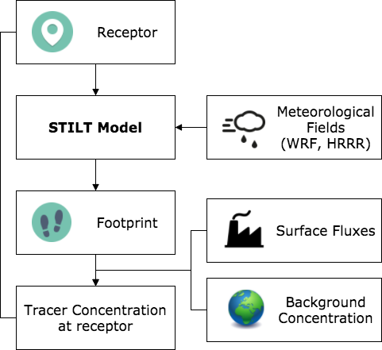

## Workflow best practices

Here we detail a generalized workflow for executing STILT simulations and applying flux inventories. In addition to the theoretical points below, several Tutorials provide workable examples to get you up and running.

---

1. Initialize a **new STILT project** with `Rscript -e "uataq::stilt_init('myproject')"`
> If the UATAQ package is not installed, see [Installation](installation.md).

1. Fetch **meteorological data** for simulations
> NOAA ARL publishes gridded [data archives](https://www.ready.noaa.gov/archives.php) for many popular meteorological models. The High Resolution Rapid Refresh (HRRR) mesoscale model data in the ARL packed format required for STILT is available at [ftp://arlftp.arlhq.noaa.gov/pub/archives/hrrr/](ftp://arlftp.arlhq.noaa.gov/pub/archives/hrrr/). The coupling of the popular Weather Research and Forecasting (WRF) model with STILT is well documented by [Nehrkorn, 2010](https://link.springer.com/article/10.1007%2Fs00703-010-0068-x). ARL packed meteorological data files must be available to STILT on the local filesystem at the path given by the `met_path` parameter, see [configuration](configuration.md) for details.

1. [Configure STILT](configure.md) using `r/run_stilt.r`
  1. Set *x*, *y*, *z*, *t* coordinates for **receptor(s)**
  1. Define **footprint grid** domain and resolution
  1. Point to the **meteorological data** you downloaded
  1. Configure parallel execution, transport, and dispersion settings (optional)
  1. Subset meteorological data grid for model domain (optional)
> Many meteorological data products are offered at a global, continental, or regional scale. STILT loads all meteorological data files that encompass the temporal domain of the simulation into memory. Reading these large files is often the largest bottleneck of simulations and is highly memory intensive. STILT provides built in methods to extract spatial subdomains from files in `met_path` when `met_subgrid_enable` is set, see [configuration](configuration.md) for details.

1. [Execute the model](execution.md) with `Rscript r/run_stilt.r`
> Run your batch of simulations, optionally leveraging distributed parallel worker processes.

1. Convolve footprints with flux inventories to estimate contribution of near-field fluxes on the receptor
> Footprint units give a *ppm* contribution from the near-field when multiplied by the flux field. For a more detailed look, the [Tutorials](https://github.com/uataq/stilt-tutorials) provide workable examples for convolving footprints with flux inventories.

1. Add background signal to estimate a model boundary condition - changes originating from sources outside of the near-field
> Background signals are often derived from measurements made just upstream from the model domain or a coarse model product such as [Carbon Tracker](https://www.esrl.noaa.gov/gmd/ccgg/carbontracker/).

1. Analysis and visualizations

---

## Next steps

- [Configuration](meteorological-data.md) to source necessary input data
- [Tutorial: Stationary simulations](https://github.com/uataq/stilt-tutorials/tree/master/01-wbb)
